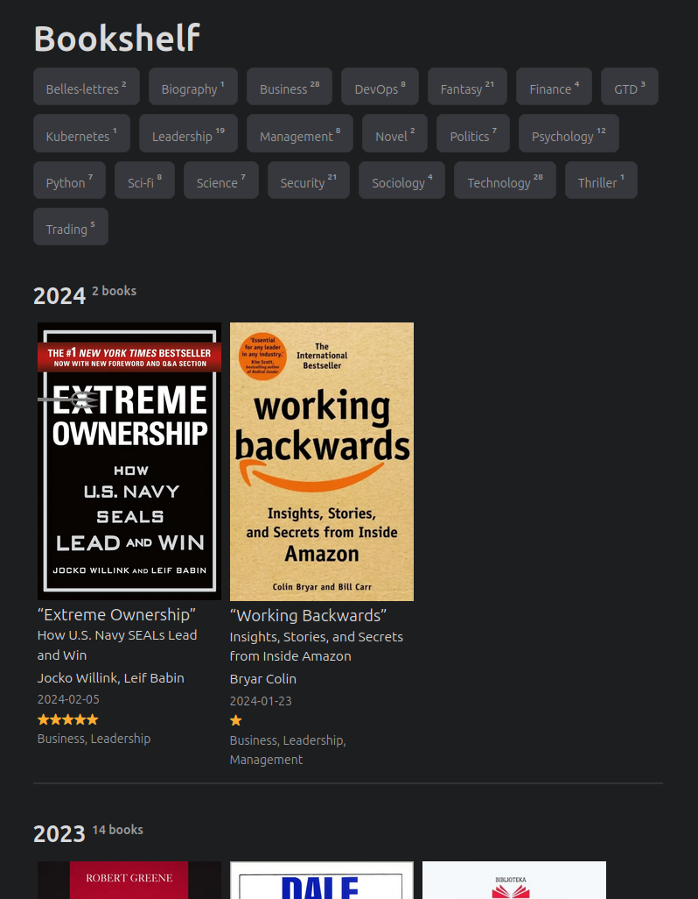
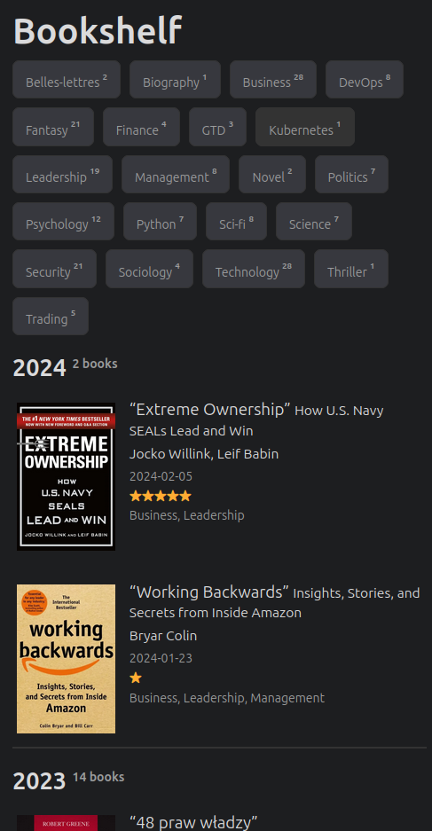

# PaperMod-bookshelf

[](https://github.com/tgagor/hugo-PaperMod-bookshelf/actions/workflows/test-and-release.yml)


This is an extension, a set of shortcodes and templates to the original [PaperMod theme](https://github.com/adityatelange/hugo-PaperMod), with a page dedicated to listing the books I've read.

[Live demo on my blog](https://gagor.pl/bookshelf/).

| Desktop view                          | Mobile view                         |
| ------------------------------------- | ----------------------------------- |
|  |  |

# Installation

1. It requires original [PaperMod theme](https://github.com/adityatelange/hugo-PaperMod), [install it first](https://github.com/adityatelange/hugo-PaperMod/wiki/Installation).

2. Clone PaperMod-bookshelf repo to your project:

- as submodule (recommended)
    ```bash
    cd your-site-location

    git submodule add --depth=1 https://github.com/tgagor/hugo-PaperMod-bookshelf.git themes/PaperMod-bookshelf
    ```

    You might need to initialize any uninitialized submodules in the repository and then recursively update all submodules to their latest versions to make it fully available:

    ```bash
    git submodule update --init --recursive
    ```

- or by just cloning
    ```bash
    cd your-site-location

    git clone --depth=1 https://github.com/tgagor/hugo-PaperMod-bookshelf.git themes/PaperMod-bookshelf
    ```

3. Update blog config:

```yaml
theme:
  - PaperMod
  - PaperMod-bookshelf
```

Original theme should be first, followed up by extension.

3. Create a page where books will be listed, for example `content/bookshelf.md` with such content:

```markdown
---
title: My Bookshelf
layout: bookshelf
url: /bookshelf
---
```

5. Add first book, by calling:

```bash
hugo new -k book books/2024/my-first-book
```

6. Run your page and check [`/bookshelf`](http://localhost:1313/bookshelf) URL.

# Adding books

Theme rely on posts in the `content/books` directory, to keep them outside of the typical posts. You might prefer other location.

To add new book, just create a new blok post type of kind `book`:

```bash
hugo new -k book books/2024/new-book
```

It will generate "a blog post" describing the book, with additional fields which are required to make the mechanism work. They are:

```yaml
title: Book's title
sub_title: Book's sub title
date: Date when you read the book
book_authors:
  - A list of
  - All the authors
categories: # used for finding the books among other posts
  - Book
tags:       # categories of books, use/extend as you want
  - Biography
  - Business
  - Fantasy
  - Finance
  - Graphic Novel
  - Leadership
  - Management
  - Mystery
  - Politics
  - Pop-sci
  - Psychology
  - Security
  - Sci-fi
  - Science
  - Sociology
  - Technology
  - Trading
book_rating: 5  # your raging 1-5 stars
```

Archetype adds a shortcode `book` call, which I preferred over typical book cover. It add's a nice header with book's cover and can provide links to few websites (reviews, affiliate links, whatever).

Rest is up to you. You can write a review or whatever :wink:

# Example configuration

Full structure of blog should look more or less like below:

```bash
$ tree your-site-location
.
├── archetypes/
│   ├── book/
│   │   ├── images/
│   │   ├── index.md
├── assets/css/extended/
├── content/
│   ├── posts/
│   │   ├── your-posts-here
│   ├── books/
│   │   ├── 2024/
│   │   |   ├── my-first-book/
│   ├── bookshelf.md
│   ├── .../
├── themes/
│   ├── PaperMod/
│   ├── PaperMod-bookshelf/
├── config.yaml
├── ...
```

If you're unable to get it working, check [`exampleSite`](./exampleSite/) directory.

# Considerations on configuration

Configuration related to the cover in the original theme might impact how books are presented. My config looks like that:

```yaml
params:
  cover:
    responsiveImages: true
    hidden: false # hide everywhere but not in structured data
    hiddenInList: false # hide on list pages and home
```

If you use `hiddenInSingle: false`, then book posts would always show a huge cover image as a cover. I didn't like it. It's best to leave this setting not configured.

Then to hide the covers for books I hide them every time by:

```yaml
cover:
  hidden: true
```

That's my preference, feel free to play settings according to your needs.
